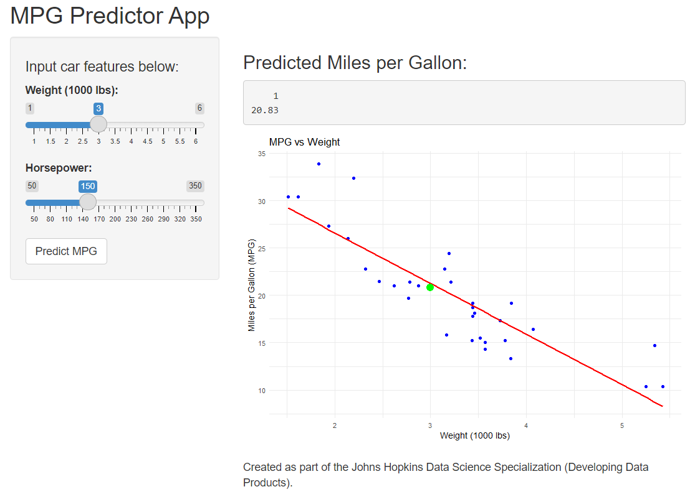

# MPG Predictor App

### A simple interactive Shiny app  
Predict car fuel efficiency based on weight and horsepower.

Created as part of the Johns Hopkins Data Science Specialization  
**Developing Data Products – Week 4**

## What the App Does

- Built using R Shiny  
- Uses the built-in `mtcars` dataset  
- Predicts **Miles per Gallon (MPG)**  
- Displays both numeric prediction and visual plot  
- User-friendly interface

## How It Works

- Linear regression model trained on mtcars:

```{r}
model <- lm(mpg ~ wt + hp, data = mtcars)
summary(model)$coefficients
User inputs weight and horsepower

App predicts MPG and displays result interactively


---

### 📈 Slide 4 — App Output
```markdown
## App Output

- Input sliders: **Weight** and **Horsepower**  
- Click **Predict MPG**  
- Output shows:
  - Predicted MPG value  
  - Scatter plot of dataset and prediction point



## Access the App

- Shiny App: [https://yourname.shinyapps.io/mpgPredictor](https://yourname.shinyapps.io/mpgPredictor)  
- GitHub Repo: [https://github.com/yourname/mpgPredictor](https://github.com/yourname/mpgPredictor)  
- Presentation: [https://rpubs.com/yourname/mpgPredictorPitch](https://rpubs.com/yourname/mpgPredictorPitch)

---

Thank you!
